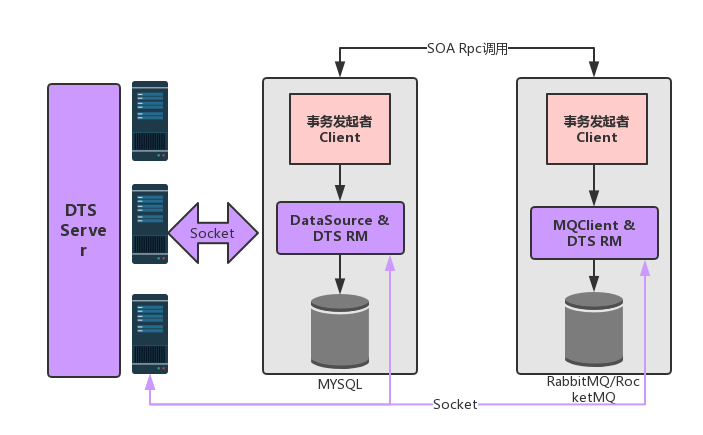

# 概述

* Dts是一款高性能、高可靠、接入简单的分布式事务解决方案,用于解决分布式环境下的事务一致性问题

# 功能

* 支持Spring Cloud下分布式事务
* 避免脏读、幻读
* 基于2PC提交方式，接入简单,只要配置一个注解就可以开启分布式事务
* 类似于阿里Gts和蚂蚁金服DTX的实现

# 架构



# 详细说明
 
 platform-dts-common: 基础包，包含client、resource与server的协议
 
 platform-dts-core: client、resource的实现
 
 platform-dts-remoting: 网络实现，基于netty实现client、reousrce于server之间的交互
 
 platform-dts-server: 事务协调器，基于netty
 
# 使用说明
 
 引入二方库坐标
 
 ```
   <dependency>
    <groupId>com.bkjk.platform.summerframework</groupId>
    <artifactId>platform-starter-dts</artifactId>
    <version>2.0.0-SNAPSHOT</version>
    </dependency>
 ```
 在服务调用方、服务提供方执行以下SQL，来保存redo/undo的日志及行锁信息
 
 ```
 DROP TABLE IF EXISTS `dts_branch_info`;
 CREATE TABLE `dts_branch_info` (
  `id` bigint(11) NOT NULL AUTO_INCREMENT,
  `trans_id` bigint(20) NOT NULL COMMENT '事务号',
  `branch_id` bigint(20) NOT NULL COMMENT '分支事务号',
  `log_info` longblob COMMENT 'undo/redo log',
  `gmt_create` datetime DEFAULT NULL COMMENT '创建时间',
  `gmt_modified` datetime DEFAULT NULL COMMENT '修改时间',
  `status` int(10) DEFAULT NULL COMMENT '事务状态',
  `instance_id` varchar(250) DEFAULT NULL COMMENT '服务实例Id',
  PRIMARY KEY (`id`),
  KEY `branch_id` (`branch_id`,`trans_id`)
) ENGINE=InnoDB DEFAULT CHARSET=latin1 COMMENT='redo/undo备份日志表';

 DROP TABLE IF EXISTS `dts_row_lock`;
 CREATE TABLE `dts_row_lock` (
  `id` bigint(11) NOT NULL AUTO_INCREMENT,
  `branch_id` bigint(20) NOT NULL COMMENT '分支事务号',
  `trans_id` bigint(20) NOT NULL COMMENT '主事务号',
  `table_name` varchar(64) NOT NULL COMMENT '表名称',
  `row_key` varchar(250) NOT NULL COMMENT '行唯一key',
  `instance_id` varchar(250) NOT NULL COMMENT '实例id',
  `gmt_create` datetime NOT NULL COMMENT '创建时间',
  `gmt_modified` datetime NOT NULL COMMENT '修改时间',
PRIMARY KEY (`id`),
UNIQUE KEY `idx_row_lock_id` (`table_name`,`row_key`)
) ENGINE=InnoDB DEFAULT CHARSET=utf8 COMMENT='行锁';
 ```
 
 服务调用方：在服务调用不同的接口添加@DtsTransaction注解，将两个服务调用纳入整个分布式事务管理
 
 ```
  @DtsTransaction
  public String rollbackDelete(@RequestBody StudentDo studentDo) {
        providerService.delete(studentDo);
        providerService.runtimeException();
        return "rollbackSelect";
   }

```

 服务提供方：在服务提供方使用Spring的@Transactional开启本地事务
 
 ```
@Transactional
 public StudentDo update(@RequestBody StudentDo studentDo) {
     studentMapper.updateById(studentDo);
     return studentDo;
 }
 ```
 
 
 DTS Server部署
 
 1:创建数据库，执行以下脚本
 
```
DROP TABLE IF EXISTS `dts_global_record`;

CREATE TABLE `dts_global_record` (
  `trans_id` bigint(20) NOT NULL AUTO_INCREMENT,
  `state` tinyint(1) NOT NULL COMMENT ' Begin(1),Committed(2),Rollbacked(3),CmmittedFailed(4),RollbackFailed(5),Commiting(6),Rollbacking(7);',
  `gmt_created` datetime NOT NULL,
  `gmt_modified` timestamp NOT NULL DEFAULT CURRENT_TIMESTAMP ON UPDATE CURRENT_TIMESTAMP,
  PRIMARY KEY (`trans_id`)
) ENGINE=InnoDB DEFAULT CHARSET=utf8 COLLATE=utf8_bin COMMENT='全局事务表';


DROP TABLE IF EXISTS `dts_branch_record`;

CREATE TABLE `dts_branch_record` (
  `branch_id` bigint(20) NOT NULL AUTO_INCREMENT,
  `trans_id` bigint(20) NOT NULL,
  `resource_ip` varchar(200) COLLATE utf8_bin NOT NULL DEFAULT '',
  `resource_info` varchar(200) COLLATE utf8_bin NOT NULL DEFAULT '',
  `state` tinyint(1) NOT NULL COMMENT ' Begin(1), Success(2),Failed(3);',
  `gmt_created` datetime NOT NULL,
  `gmt_modified` timestamp NOT NULL DEFAULT CURRENT_TIMESTAMP ON UPDATE CURRENT_TIMESTAMP,
  PRIMARY KEY (`branch_id`),
  KEY `tx_id` (`trans_id`)
) ENGINE=InnoDB DEFAULT CHARSET=utf8 COLLATE=utf8_bin COMMENT='事务分支记录表';


DROP TABLE IF EXISTS `dts_branch_error_log`;

CREATE TABLE `dts_branch_error_log` (
  `branch_id` bigint(20) NOT NULL,
  `trans_id` bigint(20) NOT NULL,
  `resource_ip` varchar(200) COLLATE utf8_bin NOT NULL,
  `resource_info` varchar(200) COLLATE utf8_bin NOT NULL,
  `state` tinyint(1) NOT NULL DEFAULT '0',
  `gmt_created` datetime NOT NULL,
  `gmt_modified` timestamp NOT NULL DEFAULT CURRENT_TIMESTAMP ON UPDATE CURRENT_TIMESTAMP,
  `is_notify` tinyint(1) DEFAULT '0',
  PRIMARY KEY (`branch_id`),
  UNIQUE KEY `branch_id` (`branch_id`),
  KEY `tx_id` (`trans_id`)
) ENGINE=InnoDB DEFAULT CHARSET=utf8 COLLATE=utf8_bin COMMENT='事务分支错误日志表';
```
 2：构建部署包
 
```
   mvn clean install -Dmaven.test.skip=true
```